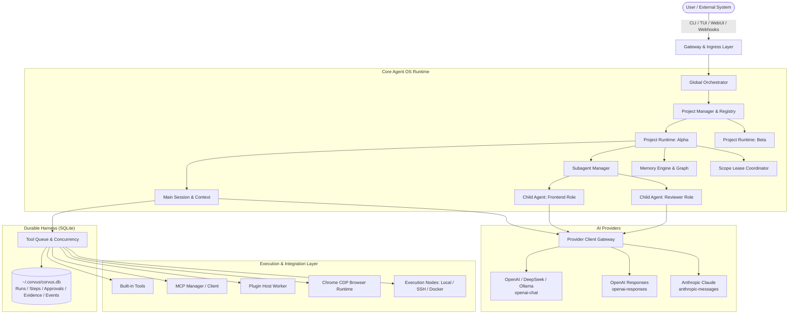

<div align="center">

# 🦅 CorvusAI

**Next-Generation Multi-Project AI Agent Orchestration Platform & Local Agent OS**

[](https://nodejs.org/)
[](https://www.typescriptlang.org/)
[](https://react.dev/)
[](https://vitejs.dev/)
[](https://www.sqlite.org/)
[](https://modelcontextprotocol.io/)
[](LICENSE)

[English](README.md) • [简体中文](README_zh.md) • [Documentation](docs/) • [Issues](https://github.com/RavenholmAlpha/CorvusAI/issues)

</div>

---

## 📖 Table of Contents

- [Overview](#-overview)
- [Key Highlights](#-key-highlights)
- [System Architecture](#-system-architecture)
- [Quick Start](#-quick-start)
- [Dual Control Surfaces](#-dual-control-surfaces)
  - [Cassette-Futurist TUI](#1-cassette-futurist-terminal-ui)
  - [Web Control Plane](#2-web-control-plane)
- [CLI Reference](#-cli-reference)
- [TUI Slash Commands](#-tui-slash-commands)
- [Built-In Tool Catalog](#-built-in-tool-catalog)
- [Configuration & Security](#-configuration--security)
  - [Configuration Layers](#configuration-layers)
  - [Secrets & Redaction](#secrets--zero-leak-redaction)
  - [Permission Presets & Policy](#permission-presets--policy)
- [MCP Interoperability](#-mcp-interoperability)
- [Skills System](#-skills-system)
- [Plugin Development](#-plugin-development)
- [Testing & Verification](#-testing--verification)
- [License](#-license)

---

## 🌟 Overview

**CorvusAI** is an industrial-grade, local-first AI Agent Orchestration Platform and **Agent OS**. Built with modern Node.js (22+), TypeScript, React 19, and SQLite, Corvus combines a distinct **Cassette-Futurist Terminal UI (Ink)** with a comprehensive **Reactive Web Control Plane (Vite + SSE)**.

Corvus goes beyond simple chat wrappers by providing a **durable state machine**, **multi-project workspace isolation**, **role-based subagent swarm collaboration**, **two-way Model Context Protocol (MCP) interoperability**, and **zero-trust permission controls**.

```text
               ┌────────────────────────────────────────────────┐
               │           Global Orchestrator Plane            │
               └───────┬────────────────────────────────┬───────┘
                       │                                │
         ┌─────────────▼─────────────┐    ┌─────────────▼─────────────┐
         │ Project Runtime: Web App  │    │ Project Runtime: Backend  │
         │  ├─ Durable Session       │    │  ├─ Durable Session       │
         │  ├─ Memory Graph          │    │  ├─ Memory Graph          │
         │  ├─ Scope Leases          │    │  ├─ Scope Leases          │
         │  └─ Role Child Agents     │    │  └─ Role Child Agents     │
         └───────────────────────────┘    └───────────────────────────┘
```

---

## ✨ Key Highlights

| Pillar | Description |
|---|---|
| 🧠 **Multi-Project Agent OS** | Run independent, durable agent runtimes across multiple workspaces simultaneously with cross-project keyword routing and global orchestration. |
| ⚡ **Durable Harness & State Machine** | SQLite-backed crash-resilient execution (`~/.corvus/corvus.db`), resumable runs (`/resume <id>`), state snapshots, tool queues, and append-only event audit logs. |
| 🌐 **Multi-Model & Protocol Engine** | Connect to any provider using `openai-chat` (`/chat/completions`), `openai-responses` (`/responses`), or `anthropic-messages` (`/messages`). Includes fallback chains, timeout/retry logic, and token budgets. |
| 🛡️ **Zero-Trust Security & Approvals** | 3 permission presets (`safe`, `balanced`, `autonomous`), granular tool/capability ACLs (`tool:<name>`, `capability:<name>`), path sandboxing, shell guards, and encrypted keyring secrets (`store:KEY`). |
| 🔌 **Bi-Directional MCP Support** | **Client**: 1-click auto-import from Claude Desktop, Cursor, and Codex. **Server**: Expose Corvus as an MCP stdio tool server (`corvus mcp-serve`) for external IDEs. |
| 🤖 **Subagents & Swarm Collaboration** | Specialist role delegation (`agentRoles`), parallel execution (`parallel_tasks`), and concurrency scope lease coordination to prevent write conflicts. |
| 📚 **Curated Project Memory Graph** | Persistent knowledge engine capturing architecture decisions, conventions, pitfalls, and handoffs, indexed with hash/vector embeddings and cross-project search. |
| 🕸️ **CDP Browser Automation & Nodes** | Headless Chrome DevTools Protocol automation (navigation, DOM snapshotting, clicks, typing, screenshots) and multi-node execution (Local, SSH, Docker). |
| 🖥️ **Dual Control Surfaces** | Switch seamlessly between the keyboard-driven Cassette-Futurist TUI and the real-time WebUI control dashboard. |
| ⏰ **Automations & Webhooks** | Schedule interval and event-driven automation jobs, or trigger agent runs via authenticated inbound webhook channels. |

---

## 🏗️ System Architecture



---

## 🚀 Quick Start

### Prerequisites

- **Node.js 22.0.0+** installed on Linux, macOS, or Windows.

### Installation

#### Option 1: Global NPM Install (Recommended)

```bash
# Install globally from npm registry
npm install --global @ravenholmalpha/corvus

# Launch interactive TUI
corvus
```

#### Option 2: Run directly with npx

```bash
npx --yes @ravenholmalpha/corvus
```

#### Option 3: One-Click Source Installers

```bash
# Linux / macOS
curl -fsSL https://raw.githubusercontent.com/RavenholmAlpha/CorvusAI/main/scripts/install.sh | bash -s -- --preset default

# Windows PowerShell
iwr -useb https://raw.githubusercontent.com/RavenholmAlpha/CorvusAI/main/scripts/install.ps1 | iex
```

### Launch Modes

```bash
# Launch interactive Cassette-Futurist TUI (default)
corvus

# Launch WebUI Control Plane alongside TUI
corvus --web

# Launch headless WebUI Control Plane (without TUI)
corvus --web-only --web-port 3081

# Run a headless prompt and exit immediately
corvus -p "Analyze the current workspace architecture and summarize findings"

# Open specific project workspace
corvus --project /path/to/my-project

# Resume a specific durable run
corvus --resume run_01jb8c9x...
```

---

## 🖥️ Dual Control Surfaces

### 1. Cassette-Futurist Terminal UI

Corvus features an Ink-based terminal user interface optimized for high-speed, keyboard-first developer workflows.

```text
┌─ CORVUS CONTROL ─────────────────────────────┬─ AGENT RUNTIME STREAM ─────────────┐
│ > 1. WORKSPACE: CorvusAI                     │ [System] Provider: deepseek-chat   │
│   2. GOAL: Implement durable harness         │ [Agent] Inspecting codebase...     │
│   3. SETTINGS                                │                                    │
│   4. RUNS & APPROVALS (1 Pending)            │ ❯ read_file { path: "src/cli.ts" } │
│   5. MEMORY GRAPH                            │ ✔ Output: 791 lines read.          │
│   6. SKILLS & PLUGINS                        │                                    │
│   7. EXIT                                    │ Corvus: Architecture verified.     │
└──────────────────────────────────────────────┴────────────────────────────────────┘
```

- **Interactive Configuration Wizard**: Run `/setting wizard` to interactively set up providers, models, endpoints, and credentials without editing raw JSON files.
- **Task Control Deck**: Run `/deck` or `/menu` to access a consolidated task dashboard.
- **Hot-Reloading**: Configuration changes take effect immediately on subsequent requests without restarting the process.

### 2. Web Control Plane

Launch with `corvus --web` to open a local, authenticated control dashboard powered by React 19 and Vite.

```text
http://127.0.0.1:3000/?token=<session-token>
```

```
├── 📊 Overview       - System health, task throughput, active runs, memory metrics
├── 💬 Chat           - Multi-session chat interface with real-time SSE token streaming
├── 📁 Projects       - Multi-project workspace registry, session management, and project activation
├── 🤖 Agents         - Global Orchestrator → Project Agents → Role child-task graph
├── 📋 Tasks          - Inspect, track, and cancel active subagent tasks
├── 🛡️ Approvals      - Human-in-the-loop tool approval modal with diff inspection
├── 🧠 Memory         - Interactive project memory graph (Architecture, Decisions, Pitfalls)
├── 📜 Timeline       - Append-only event audit log with full event inspection and JSON export
├── ⚡ Skills         - Global and project-scoped skills registry and triggers
├── ⏰ Automations    - Cron and interval scheduler for recurring agent tasks
├── 📡 Channels       - Authenticated inbound webhook management and egress queues
├── 🔀 Routing        - Cross-project keyword routing rules
├── 🌐 Browser        - Live Chrome DevTools Protocol automation viewport and page management
├── 🖥️ Nodes          - Local, SSH, and Docker execution nodes status
├── 🧩 Integrations   - MCP server discovery, import, OAuth, and configuration
├── 📦 Installation   - Feature bundles (Minimal / Default / Full) and plugin manager
└── ⚙️ Settings       - Full provider and role policy editor, diagnostics, and DB backups
```

---

## ⌨️ CLI Reference

```bash
corvus [options] [subcommand] [prompt]
```

### Core Flags

| Option | Alias | Description |
|---|---|---|
| `--version` | `-v` | Display Corvus version |
| `--help` | `-h` | Show CLI help message |
| `--web` | | Start WebUI Control Plane alongside interactive TUI |
| `--web-only` | | Start WebUI Control Plane in background without TUI |
| `--web-port <port>` | | Specify custom port for WebUI (default: `3000` / `3081`) |
| `--project <path>` | `-P` | Activate a specific project directory |
| `--print "<prompt>"` | `-p` | Execute a single prompt in headless mode and output result |
| `--resume <runId>` | | Resume execution of a specific paused or pending durable run |
| `--auto-approve` | `-y` | Automatically approve all tool execution requests (use with care) |
| `--restore-db <file>` | | Restore Corvus SQLite database from a backup before startup |

### Subcommands

```bash
# System health check & diagnostics
corvus doctor [--json] [--deep]

# Feature bundle management (minimal | default | full | custom)
corvus bundle plan <preset>
corvus bundle apply <preset>

# Plugin management
corvus plugin list
corvus plugin install <path-or-repo>
corvus plugin enable <plugin-id>
corvus plugin disable <plugin-id>
corvus plugin remove <plugin-id>

# Encrypted secret store
corvus secret list
corvus secret set <key-name>
corvus secret delete <key-name>

# Model Context Protocol (MCP)
corvus mcp-serve                     # Expose Corvus as stdio MCP Server
corvus mcp-import [--dry-run]        # Auto-import MCP configs from Claude/Cursor/Codex
corvus mcp-oauth <server-id>         # Perform OAuth authentication for MCP server

# Permission preset switching (safe | balanced | autonomous)
corvus permission safe
corvus permission balanced
corvus permission autonomous
```

---

## 🕹️ TUI Slash Commands

Type `/` in the interactive TUI to access runtime commands:

### Session & Navigation
- `/menu`, `/deck`: Show task-oriented control deck.
- `/status`: Show model, provider, endpoint, tool, plugin, and permission state.
- `/sessions`: List and switch between durable chat sessions.
- `/workspace`: List registered project workspaces or switch active workspace.
- `/clear`: Clear terminal viewport.
- `/compact`: Compact session context window.
- `/exit`: Gracefully shut down Corvus.

### Durable Runs & Approvals
- `/runs`: List durable execution runs and statuses.
- `/run <id>`: Inspect detailed run history, messages, and state snapshots.
- `/resume <id>`: Resume a paused or pending durable run.
- `/cancel <id>`: Cancel an active run or subagent task.
- `/approvals`: List pending tool approval requests.
- `/approve <id|all>`: Approve pending tool execution.
- `/deny <id|all>`: Deny pending tool execution.
- `/evidence [id|last]`: View tool execution outputs, errors, or model failure evidence.

### Configuration & Policy
- `/setting wizard`: Launch interactive step-by-step configuration wizard.
- `/setting [show|key value]`: Inspect or update configuration keys at runtime.
- `/model [name] [--endpoint url] [--api-key KEY]`: Quick-switch model configuration.
- `/permission [tool:name|capability:name] [allow|ask|deny]`: Manage granular tool permissions.
- `/preset [safe|balanced|autonomous]`: Switch permission preset.
- `/goal [text]`: Set or display the active working goal.
- `/review [on|off|status]`: Toggle automated code review prompt constraints.
- `/tools`: List all registered AI-callable tools.
- `/plugins`: List loaded dynamic plugins and health status.
- `/config`: Display active layered configuration.

---

## 🧰 Built-In Tool Catalog

Corvus comes with a comprehensive suite of secure built-in tools organized by namespace and capability:

### 📁 Filesystem & Shell
| Tool | Capability | Default Policy | Description |
|---|---|---|---|
| `read_file` | `local` | `allow` | Read file contents with optional byte limits and path boundary enforcement. |
| `write_file` | `local` | `ask` | Write content to a file with directory auto-creation. |
| `replace_file_content` | `local` | `ask` | Replace exact text occurrences safely within a file. |
| `patch_file` | `local` | `ask` | Apply unified/fuzzy patch blocks to targeted files. |
| `list_dir` | `local` | `allow` | List directory contents and file metadata. |
| `grep_search` | `local` | `allow` | High-speed regex or literal content search across directory trees. |
| `shell` | `shell` | `ask` | Execute sandboxed shell commands with timeout guards and output capture. |
| `git_status` | `local` | `allow` | Query branch, dirty files, staged changes, and commit state. |

### 🤖 Multi-Agent & Orchestration
| Tool | Capability | Default Policy | Description |
|---|---|---|---|
| `task` | `local` | `allow` | Spawn an isolated subagent to handle a specific subtask using a designated role. |
| `parallel_tasks` | `local` | `allow` | Execute multiple subagent tasks concurrently with scope lease protection. |
| `dispatch_project_task` | `orchestrator` | `allow` | Dispatch a task across project boundaries to another registered workspace. |
| `check_subagent_task` | `agent` | `allow` | Query status, result sessions, or errors of delegated subagent tasks. |
| `manage_role` | `orchestrator` | `ask` | Create, update, or remove reusable specialist agent roles. |
| `list_workspaces` | `orchestrator` | `allow` | List all registered project workspaces and their active sessions. |
| `register_workspace` | `orchestrator` | `ask` | Register a new project directory in the global multi-project catalog. |
| `unregister_workspace` | `orchestrator` | `ask` | Unregister a workspace while preserving filesystem contents. |
| `get_workspace_summary` | `orchestrator` | `allow` | Summarize workspace stack, git state, and recent architecture memories. |

### 🧠 Project Memory Engine
| Tool | Capability | Default Policy | Description |
|---|---|---|---|
| `record_project_memory` | `orchestrator` | `allow` | Persist architecture decisions, conventions, pitfalls, or handoffs. |
| `search_global_memory` | `orchestrator` | `allow` | Semantic hash-embedding search across global and project-scoped memories. |

### 🌐 Browser CDP Automation
| Tool | Capability | Default Policy | Description |
|---|---|---|---|
| `browser_pages` | `browser.control` | `allow` | List open browser pages in the connected Chrome instance. |
| `browser_open` | `browser.control` | `ask` | Open a safe public HTTP/HTTPS page in a new browser tab. |
| `browser_navigate` | `browser.control` | `ask` | Navigate an existing page to a new URL. |
| `browser_snapshot` | `browser.control` | `allow` | Extract structured DOM accessibility tree snapshot. |
| `browser_click` | `browser.control` | `ask` | Click specific coordinates on the active page. |
| `browser_type` | `browser.control` | `ask` | Type non-sensitive text into focused input elements. |
| `browser_press` | `browser.control` | `ask` | Dispatch keyboard key presses (Enter, Escape, Tab, etc.). |
| `browser_screenshot` | `browser.control` | `allow` | Capture viewport or full-page base64 PNG screenshot. |

### 🔌 Extensibility & System
| Tool | Capability | Default Policy | Description |
|---|---|---|---|
| `web_fetch` | `network` | `ask` | Make safe HTTP requests with SSRF protections and safe URL enforcement. |
| `now` | `local` | `allow` | Get current ISO timestamp and timezone information. |
| `manage_mcp` | `orchestrator` | `ask` | Dynamically list, add, remove, test, or import MCP server configs. |
| `manage_skill` | `orchestrator` | `ask` | Create, list, or delete global and workspace skills. |

---

## 🔒 Configuration & Security

### Configuration Layers

Corvus resolves configuration deterministically with a 3-tier precedence chain:

```text
Built-in Tier (builtin/)  <  User Global (~/.corvus/config.json)  <  Workspace Local (<workspace>/.corvus/config.json)
```

```json
{
  "$schema": "./schema/config.schema.json",
  "schemaVersion": 2,
  "endpoint": "https://api.deepseek.com/v1",
  "model": "deepseek-chat",
  "apiKeyRef": "env:DEEPSEEK_API_KEY",
  "temperature": 0.2,
  "providers": {
    "deepseek": {
      "id": "deepseek",
      "protocol": "openai-chat",
      "endpoint": "https://api.deepseek.com/v1",
      "model": "deepseek-chat",
      "apiKeyRef": "env:DEEPSEEK_API_KEY"
    },
    "claude": {
      "id": "claude",
      "protocol": "anthropic-messages",
      "endpoint": "https://api.anthropic.com/v1",
      "model": "claude-3-7-sonnet-20250219",
      "apiKeyRef": "store:ANTHROPIC_KEY"
    }
  },
  "agentRoles": {
    "reviewer": {
      "id": "reviewer",
      "label": "Code & Architecture Reviewer",
      "providerId": "claude",
      "systemPrompt": "Perform rigorous code reviews with focus on security, performance, and maintainability."
    }
  },
  "permissions": {
    "preset": "balanced",
    "rules": {
      "tool:shell": "ask",
      "tool:write_file": "ask",
      "capability:network": "ask"
    }
  }
}
```

### Secrets & Zero-Leak Redaction

- **Environment References**: Use `apiKeyRef: "env:VARIABLE_NAME"` to reference environment variables without committing plaintext keys.
- **Encrypted Keyring Store**: Use `apiKeyRef: "store:SECRET_NAME"` with `corvus secret set <name>` to store credentials in an encrypted local keystore.
- **Automatic Redaction**: All API keys and secrets are automatically masked in TUI logs, WebUI responses, SSE event streams, and database exports.

### Permission Presets & Policy

| Preset | Read Files / Query Status | Write Files / Patch | Execute Shell Commands | Network Requests | Browser Actions |
|---|---|---|---|---|---|
| 🟢 `safe` | `allow` | `ask` | `deny` | `ask` | `ask` |
| 🟡 `balanced` *(Default)* | `allow` | `ask` | `ask` | `ask` | `ask` |
| 🔴 `autonomous` | `allow` | `allow` | `allow` | `allow` | `allow` |

Apply presets instantly with `corvus permission <preset>` or `/permission preset <name>`.

---

## 🌐 MCP Interoperability

Corvus provides first-class, bi-directional support for Anthropic's **Model Context Protocol (MCP)**.

### 1. Client Mode: Auto-Import External Servers

Automatically discover and import existing MCP server configurations from Claude Desktop, Cursor (Global & Workspace), and Codex:

```bash
# Preview discovered MCP servers without modifying config
corvus mcp-import --dry-run

# Import and merge servers into ~/.corvus/config.json
corvus mcp-import
```

### 2. Server Mode: Expose Corvus to IDEs

Expose Corvus tools and agent swarms as a standard stdio MCP Server to Claude Desktop or Cursor:

Add to your `claude_desktop_config.json` or Cursor MCP settings:

```json
{
  "mcpServers": {
    "corvus": {
      "command": "corvus",
      "args": ["mcp-serve"]
    }
  }
}
```

---

## ⚡ Skills System

Skills are modular capability extensions organized into self-contained directories.

### Precedence Hierarchy

```text
Built-in (dist/builtin/skills/) < Global (~/.corvus/skills/) < Workspace (<workspace>/.corvus/skills/)
```

### Writing a Custom Skill (`SKILL.md`)

```markdown
---
name: "git-release"
description: "Automate semantic versioning, changelog generation, and GitHub releases"
triggers:
  - "create release"
  - "publish version"
  - "bump version"
tools_required:
  - "shell"
  - "read_file"
  - "write_file"
---

# Git Release Workflow Instructions

1. Check current git status using `git_status`.
2. Inspect package version in `package.json`.
3. Update version, generate changelog, and draft release tag.
```

Trigger phrases activate skill instructions dynamically when relevant to user prompts.

---

## 🔌 Plugin Development

Corvus features a robust Plugin Architecture (Manifest v1) running on isolated worker threads.

### Plugin Manifest (`corvus-plugin.json`)

```json
{
  "manifestVersion": 1,
  "id": "my-custom-plugin",
  "name": "My Custom Plugin",
  "version": "1.0.0",
  "description": "Adds specialized domain tools to Corvus",
  "entry": "dist/index.js",
  "capabilities": ["local", "network"],
  "contributes": {
    "tools": [
      {
        "name": "custom_action",
        "description": "Performs custom action",
        "capability": "local"
      }
    ]
  }
}
```

### Plugin SDK Export

```typescript
import { definePlugin } from "@ravenholmalpha/corvus/plugin-sdk";

export default definePlugin({
  async activate(context) {
    context.registerTool({
      name: "custom_action",
      description: "Performs custom action",
      parameters: {
        type: "object",
        properties: {
          input: { type: "string" }
        },
        required: ["input"]
      },
      async execute({ input }) {
        return { ok: true, output: `Processed: ${input}` };
      }
    });
  }
});
```

---

## 🧪 Testing & Verification

Corvus maintains rigorous test coverage spanning unit, integration, WebUI, and durable harness E2E test suites:

```bash
# Run all unit and integration tests (CLI + WebUI)
npm test

# Run WebUI tests specifically
npm run test:web

# Run TypeScript typechecks across source and test files
npm run lint

# Build production bundle (WebUI + Backend + Builtins)
npm run build

# Generate Software Bill of Materials (SBOM)
npm run sbom

# Generate and sign release manifest
npm run release:manifest
npm run release:sign
```

---

## 📄 License

This project is licensed under the **MIT License**. See the [LICENSE](LICENSE) file for details.

<div align="center">

**[CorvusAI](https://github.com/RavenholmAlpha/CorvusAI)** — Crafted for Resilient, Autonomous, and Multi-Agent Engineering.

</div>
