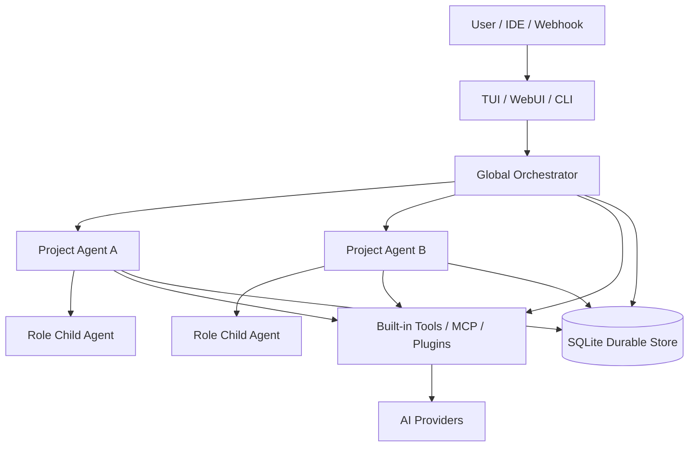

<div align="center">

# 🦅 CorvusAI

**Local-first multi-project AI agent orchestration platform and durable Agent OS**

[](https://github.com/RavenholmAlpha/CorvusAI/releases/latest)
[](https://github.com/RavenholmAlpha/CorvusAI/actions/workflows/release.yml)
[](https://nodejs.org/)
[](https://www.typescriptlang.org/)
[](LICENSE)

[English](README.md) · [简体中文](README_zh.md) · [Documentation](docs/) · [Releases](https://github.com/RavenholmAlpha/CorvusAI/releases) · [Issues](https://github.com/RavenholmAlpha/CorvusAI/issues)

</div>

---

## What is CorvusAI?

CorvusAI is a Node.js 22+ AI agent runtime for software engineering and local automation. It combines:

- a keyboard-driven Ink terminal UI;
- an authenticated local React WebUI;
- durable SQLite-backed runs, approvals, evidence, tasks, and memories;
- a global orchestrator, project agents, and role-specialized child agents;
- OpenAI Chat, OpenAI Responses, and Anthropic Messages provider protocols;
- MCP client/server interoperability, Skills, plugins, browser automation, and execution nodes;
- explicit permission policies for filesystem, shell, network, and other high-risk actions.

Corvus stores user data outside the installed package under `~/.corvus` (`%USERPROFILE%\.corvus` on Windows), so upgrades do not replace your configuration or durable database.

> **Current release:** [v0.1.0](https://github.com/RavenholmAlpha/CorvusAI/releases/tag/v0.1.0). The npm registry package is not published yet; use the verified GitHub Release installation command below.

## Contents

- [Install](#install)
- [First run](#first-run)
- [Launch modes](#launch-modes)
- [Architecture](#architecture)
- [Providers and roles](#providers-and-roles)
- [Multi-project orchestration](#multi-project-orchestration)
- [Durable runs and approvals](#durable-runs-and-approvals)
- [Project memory](#project-memory)
- [MCP interoperability](#mcp-interoperability)
- [Skills and plugins](#skills-and-plugins)
- [WebUI](#webui)
- [CLI reference](#cli-reference)
- [TUI commands](#tui-commands)
- [Built-in tools](#built-in-tools)
- [Configuration](#configuration)
- [Security](#security)
- [Troubleshooting](#troubleshooting)
- [Development and release verification](#development-and-release-verification)

---

## Install

### Requirements

- Node.js **22 or newer**
- npm
- Linux, macOS, or Windows

Check your runtime:

```bash
node --version
npm --version
```

### Verified one-command install

No clone or source checkout is required:

```bash
npm install --global https://github.com/RavenholmAlpha/CorvusAI/releases/download/v0.1.0/ravenholmalpha-corvus-0.1.0.tgz
```

Verify:

```bash
corvus --version
# corvus 0.1.0
```

The release tarball is built by GitHub Actions and published with an SBOM and release manifest. See the [v0.1.0 assets](https://github.com/RavenholmAlpha/CorvusAI/releases/tag/v0.1.0).

### npm registry status

The package metadata is reserved for:

```bash
npm install --global @ravenholmalpha/corvus
npx --yes @ravenholmalpha/corvus
```

These commands will work only after `@ravenholmalpha/corvus` is published to npm. At present, use the GitHub Release command above.

### Upgrade or reinstall

Re-run the GitHub Release install command. Corvus data remains under `~/.corvus`. Back up before major upgrades:

```bash
# Linux/macOS
cp -R ~/.corvus ~/.corvus-backup
```

```powershell
# Windows
Copy-Item -Recurse $HOME.corvus $HOME.corvus-backup
```

---

## First run

Start the terminal interface:

```bash
corvus
```

Then run:

```text
/setting wizard
```

Configure at least:

1. provider protocol;
2. API endpoint;
3. model;
4. API key or secret reference;
5. main provider.

Provider authentication errors such as `API key is invalid` come from the selected AI provider, not GitHub or the Corvus Release. Verify the endpoint/model/key combination and ensure the main provider points to the intended provider.

Configuration is stored at:

| Platform | Default path |
|---|---|
| Linux/macOS | `~/.corvus/config.json` |
| Windows | `%USERPROFILE%\.corvus\config.json` |
| Override | Set `CORVUS_HOME` |

---

## Launch modes

```bash
# Interactive TUI
corvus

# TUI plus local WebUI
corvus --web

# WebUI without TUI
corvus --web-only

# Custom WebUI port
corvus --web-only --web-port 3085

# One headless prompt
corvus --print "Review this workspace"

# Select a registered project by ID or name
corvus --project my-project

# Resume a durable run
corvus --resume run_id
```

The Web server binds to `127.0.0.1` and defaults to port **3081**. Corvus prints an access URL containing a random session token, for example:

```text
http://127.0.0.1:3081/?token=<random-token>
```

Do not expose this local control plane directly to the public internet.

---

## Architecture



### Three-level governance

1. **Global orchestrator** — sees registered workspaces and routes cross-project work.
2. **Project agent** — owns a project session and operates in that workspace.
3. **Role child agent** — receives an isolated context, provider/model policy, allowed tools, skills, limits, and a durable task record.

### Durable SQLite state

`~/.corvus/corvus.db` stores runs, steps, messages, tool calls, approvals, evidence, events, projects, sessions, subagent tasks, scope leases, memories, and scheduler/channel state. Startup runs idempotent compatibility migrations before querying project state.

---

## Providers and roles

### Supported provider protocols

| Protocol | API path | Typical systems |
|---|---|---|
| `openai-chat` | `/chat/completions` | OpenAI-compatible gateways, DeepSeek, Ollama/vLLM compatibility APIs |
| `openai-responses` | `/responses` | OpenAI Responses API |
| `anthropic-messages` | `/messages` | Anthropic Claude Messages API |

Providers own connection details. Roles reference providers and describe a reusable specialty. Multiple roles may share one provider.

### Role example

```json
{
  "agentRoles": {
    "reviewer": {
      "id": "reviewer",
      "label": "Code reviewer",
      "providerId": "deepseek",
      "model": "deepseek-chat",
      "temperature": 0.2,
      "systemPrompt": "Review correctness, security, error handling, tests, and regression risk.",
      "allowedTools": ["read_file", "grep_search", "git_status"],
      "maxConcurrent": 2
    }
  }
}
```

Configured roles are injected into agent system context. The main agent can select them proactively with the `role` argument on `task`, `parallel_tasks`, or `dispatch_project_task`.

Example agent tool input:

```json
{
  "projectId": "project_id",
  "prompt": "Review the current changes and report prioritized findings.",
  "description": "Release review",
  "role": "reviewer",
  "background": true
}
```

The built-in `manage_role` tool supports `list`, `create`, `update`, and `delete`. Changes are persisted and system prompts are refreshed without restarting Corvus.

See [Provider, Role, and TUI setup](docs/PROVIDERS.md).

---

## Multi-project orchestration

Corvus can register multiple local repositories and maintain separate project sessions.

Relevant tools:

- `list_workspaces`
- `register_workspace`
- `unregister_workspace`
- `get_workspace_summary`
- `dispatch_project_task`
- `check_subagent_task`

Use `background: true` with `dispatch_project_task` to receive a task ID immediately, then query it with `check_subagent_task`.

Scope leases coordinate concurrent child tasks and reduce conflicting writes to the same path. They are coordination controls, not an OS-level sandbox.

---

## Durable runs and approvals

Every durable run can include:

- model and tool steps;
- persisted messages;
- tool-call arguments and results;
- pending or resolved approvals;
- evidence records;
- append-only events and snapshots;
- a resumable status.

Typical workflow:

```text
/runs
/run <run-id>
/approvals
/approve <approval-id>
/resume <run-id>
/evidence last
```

Permission `ask` pauses a high-risk call for a human decision. Approval is not bypassed merely because Corvus is running headlessly or as an MCP server.

---

## Project memory

The memory engine persists knowledge in these categories:

- `architecture`
- `decision`
- `pitfall`
- `convention`
- `handoff`
- internal open issues

`record_project_memory` writes project or global memory and indexes it. `search_global_memory` searches global knowledge or combines project and global scopes. Successful delegated tasks can also produce curated handoff memories.

The workspace summary includes Git status, detected stack files, durable project tasks, and the latest architecture memory.

---

## MCP interoperability

### MCP client

Corvus can connect to stdio or HTTP MCP servers, discover their tools, and register names such as:

```text
mcp_github_<tool>
mcp_postgres_<tool>
```

The `manage_mcp` tool and WebUI support:

- list/add/remove server configuration;
- connection testing;
- runtime reload without restarting Corvus;
- import from Claude Desktop, Cursor global/workspace, and Codex.

CLI import:

```bash
corvus mcp-import --dry-run
corvus mcp-import

# equivalent alias
corvus mcp import --dry-run
corvus mcp import
```

Existing Corvus server names win merge conflicts.

### MCP server

Expose Corvus to an MCP-capable client:

```json
{
  "mcpServers": {
    "corvus": {
      "command": "corvus",
      "args": ["mcp-serve"]
    }
  }
}
```

MCP calls remain subject to Corvus permissions.

---

## Skills and plugins

### Skills

Skill precedence is deterministic:

```text
built-in < ~/.corvus/skills < <workspace>/.corvus/skills
```

A Skill lives at `<skill-id>/SKILL.md`:

```markdown
---
name: review-release
description: Review a release candidate
triggers: [review release, release audit]
tools_required: [read_file, grep_search, git_status]
---
# Review Release
Inspect implementation, tests, compatibility, security, and rollback risk.
```

The `manage_skill` tool and WebUI can create, list, and delete global or workspace skills. A routed skill is activated only when its trigger matches and its required tools are available.

### Plugins

Plugins use `corvus.plugin.json` and an ESM entry. Supported runtime modes include native, worker, MCP, and declarative. Native plugins are trusted in-process code; capability declarations are not an operating-system sandbox.

CLI management:

```bash
corvus plugin list
corvus plugin install ./path/to/plugin
corvus plugin enable plugin-id
corvus plugin disable plugin-id
corvus plugin remove plugin-id
```

See [Plugin authoring](docs/plugin-authoring.md).

---

## WebUI

Start it with `corvus --web` or `corvus --web-only`.

Main pages:

| Page | Purpose |
|---|---|
| Chat | Global/project sessions, SSE streaming, task activity, stop control |
| Overview | Runtime and configuration health |
| Projects | Register, activate, summarize, sync status, and unload workspaces |
| Hierarchy | Global → project → child-agent graph |
| Tasks | Durable subagent task status and cancellation |
| Approvals | Inspect and decide pending tool calls |
| Memory | Add, filter, obsolete, and link project memories |
| Timeline | Events, evidence, inspection, and audit export |
| Skills | Create and inspect global/project Skills |
| MCP & Plugins | Configure, test, import, and reload MCP servers; inspect plugins |
| Channels | Authenticated inbound channels and delivery state |
| Automations | Interval/event jobs and scheduler state |
| Routing | Cross-project keyword routing |
| Browser | Configured CDP pages and controls |
| Nodes | Local/SSH/Docker execution node state |
| Bundles | Feature preset planning and application |
| Secrets | Encrypted secret-store metadata |
| Settings | Provider, role, browser/node, diagnostics, and backup controls |

Every `/api/*` call requires the generated Web token unless Web auth was explicitly disabled by an embedding application. See [WebUI operations and security](docs/WEBUI.md).

---

## CLI reference

```text
corvus [options]
corvus <subcommand> [action] [value]
```

### Options

| Option | Alias | Description |
|---|---|---|
| `--version` | `-v` | Print version |
| `--help` | `-h` | Print help |
| `--print <prompt>` | `-p` | Run one headless prompt |
| `--resume <run-id>` | | Resume a durable run |
| `--project <id-or-name>` | `-P` | Select a registered project |
| `--web` | | Start WebUI with TUI |
| `--web-only` | | Start WebUI without TUI |
| `--web-port <port>` | | Override Web port (default 3081) |
| `--auto-approve` | `--yes`, `-y` | Change configured `ask` rules to `allow` for this process; use carefully |
| `--restore-db <path>` | | Restore a DB backup before startup |

### Subcommands

```bash
corvus setup <minimal|default|full|custom>
corvus bundle plan <minimal|default|full|custom>
corvus bundle apply <minimal|default|full|custom>
corvus permission <safe|balanced|autonomous>
corvus doctor [--json] [--deep]

corvus plugin list
corvus plugin install <directory>
corvus plugin enable <id>
corvus plugin disable <id>
corvus plugin remove <id>

corvus secret list
# For non-interactive set, provide CORVUS_SECRET_VALUE
corvus secret set <name>
corvus secret delete <name>

corvus mcp-import [--dry-run]
corvus mcp-oauth <server-id>
corvus mcp-serve
```

---

## TUI commands

Common slash commands:

| Command | Purpose |
|---|---|
| `/menu`, `/deck` | Open task control deck |
| `/setting wizard` | Interactive setup |
| `/status` | Runtime/provider/tool state |
| `/model ...` | Quick model configuration |
| `/permission ...` | Tool/capability policy |
| `/goal ...` | Show/set active goal |
| `/review on|off|status` | Review instruction mode |
| `/runs`, `/run <id>`, `/resume <id>`, `/cancel <id>` | Durable execution control |
| `/approvals`, `/approve ...`, `/deny ...` | Approval control |
| `/evidence ...` | Inspect evidence |
| `/tools`, `/plugins`, `/config` | Inspect capabilities/config |
| `/compact` | Compact long conversation context |
| `/clear` | Clear current in-memory context |
| `/exit` | Shut down |

Use `/help` in the installed version for the authoritative command list.

---

## Built-in tools

### Filesystem, process, web, and Git

- `read_file`, `write_file`
- `list_dir`, `grep_search`
- `replace_file_content`, `patch_file`
- `shell`
- `web_fetch`
- `git_status`
- `now`

### Delegation and governance

- `task`, `parallel_tasks`
- `dispatch_project_task`, `check_subagent_task`
- `list_workspaces`, `register_workspace`, `unregister_workspace`
- `get_workspace_summary`
- `manage_role`

### Knowledge and extensibility

- `record_project_memory`, `search_global_memory`
- `manage_mcp`
- `manage_skill`

### Optional browser tools

When the browser feature and CDP endpoint are configured:

- `browser_pages`, `browser_open`, `browser_navigate`
- `browser_snapshot`, `browser_click`, `browser_type`, `browser_press`
- `browser_screenshot`

The actual tool set depends on the active bundle, plugins, MCP connections, and role allow/deny lists. Use `/tools` for the live catalog.

---

## Configuration

Corvus merges configuration in this order:

```text
built-in defaults < ~/.corvus/config.json < <workspace>/.corvus/config.json
```

Minimal provider/role example:

```json
{
  "schemaVersion": 2,
  "endpoint": "https://api.deepseek.com/v1",
  "model": "deepseek-chat",
  "apiKey": "",
  "apiKeyEnv": "DEEPSEEK_API_KEY",
  "providers": {
    "deepseek": {
      "id": "deepseek",
      "label": "DeepSeek",
      "protocol": "openai-chat",
      "endpoint": "https://api.deepseek.com/v1",
      "apiKey": "",
      "apiKeyRef": "env:DEEPSEEK_API_KEY",
      "models": ["deepseek-chat"],
      "defaultModel": "deepseek-chat"
    }
  },
  "mainProviderId": "deepseek",
  "agentRoles": {
    "reviewer": {
      "id": "reviewer",
      "label": "Reviewer",
      "providerId": "deepseek",
      "systemPrompt": "Review correctness, security, tests, and regression risk."
    }
  }
}
```

Prefer `apiKeyRef` to plaintext:

- `env:VARIABLE_NAME` — environment variable;
- `store:SECRET_NAME` — Corvus encrypted local secret store.

Workspace configuration should contain only overrides. Map-like settings such as providers, roles, MCP servers, and plugin settings merge with global values.

### Feature bundles

| Bundle | Intended use |
|---|---|
| `minimal` | Small local core |
| `default` | Recommended developer setup with memory, skills, delegation, workspaces, MCP client, and WebUI |
| `full` | Adds browser, scheduler, channels, execution nodes, and MCP server features |
| `custom` | Explicit component selection |

Bundles enable product components but do not silently widen permissions.

---

## Security

- Tool decisions support `allow`, `ask`, and `deny`.
- Rules can target `tool:<name>` or `capability:<name>`.
- Path and shell guards enforce configured local boundaries.
- Network requests apply safe URL/SSRF checks.
- WebUI uses a random local session token and same-origin checks.
- Webhook replay and duplicate-message protections are persisted.
- API keys and secret references are redacted from Web state and diagnostics.
- Native plugins are trusted code; inspect them before enabling.
- `autonomous` and `--auto-approve` should be used only in controlled environments.

Do not commit `~/.corvus/config.json`, databases, or real credentials.

---

## Troubleshooting

### `API key is invalid`

Verify all four values belong together:

1. provider protocol;
2. endpoint;
3. model;
4. API key.

Also verify `mainProviderId` points to that provider and that an `env:...` reference is available in the same process that launches Corvus. Run:

```bash
corvus doctor --json
```

### `no such column: updated_at`

This indicates an older SQLite schema. Upgrade to the latest release and launch Corvus again; startup compatibility migrations add missing columns before project queries. Back up `~/.corvus/corvus.db` first. If an obsolete installation is still first on `PATH`, inspect it with:

```bash
corvus --version
npm list --global --depth=0
```

As a last resort—only if durable history is disposable—stop Corvus, back up `~/.corvus`, rename `corvus.db`, and restart to create a fresh database.

### `corvus` command not found

Ensure the npm global bin directory is on `PATH`, then reopen the terminal:

```bash
npm prefix --global
```

### WebUI does not open

Use the exact tokenized URL printed by Corvus. Check for a port conflict and select another port:

```bash
corvus --web-only --web-port 3085
```

### Native SQLite install errors

Corvus depends on `better-sqlite3`. Use a supported Node.js 22+ release and the correct architecture. If npm cannot use a prebuilt binary, install the native build prerequisites for your platform.

### Diagnostics and backup

```bash
corvus doctor --json
```

Create backups from WebUI Settings. Restore before startup with:

```bash
corvus --restore-db /path/to/backup.db
```

---

## Development and release verification

Clone only when developing Corvus itself:

```bash
git clone https://github.com/RavenholmAlpha/CorvusAI.git
cd CorvusAI
npm ci
npm run build
npm run dev
```

Verification commands:

```bash
npx tsc -p tsconfig.json --noEmit
npx tsc -p webui/tsconfig.json --noEmit
npm run build
npm test
npm audit --audit-level=high
npm pack --dry-run
```

Release workflow: [.github/workflows/release.yml](.github/workflows/release.yml)

Release artifacts include:

- npm-compatible `.tgz` archive;
- release manifest with file hashes;
- CycloneDX-style SBOM JSON and SHA-256 file;
- optional manifest signature when a signing key is configured.

Detailed documentation:

- [Agent OS architecture](docs/AGENT_OS.md)
- [Providers and roles](docs/PROVIDERS.md)
- [Model profiles](docs/MODEL_PROFILES.md)
- [WebUI](docs/WEBUI.md)
- [Plugin authoring](docs/plugin-authoring.md)

---

## License

CorvusAI is available under the [MIT License](LICENSE).

<div align="center">

**[CorvusAI](https://github.com/RavenholmAlpha/CorvusAI)** — durable local agent orchestration for real engineering work.

</div>
