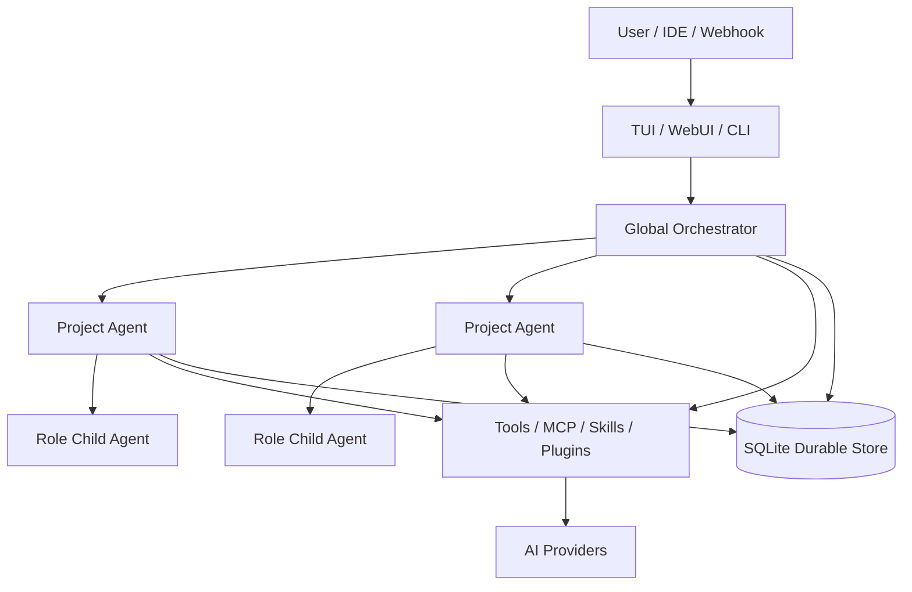

<div align="center">

# CorvusAI

**A local-first, durable AI agent runtime for multi-project software engineering.**

[](https://github.com/RavenholmAlpha/CorvusAI/releases/latest)
[](https://github.com/RavenholmAlpha/CorvusAI/actions/workflows/release.yml)
[](https://nodejs.org/)
[](LICENSE)

[中文](README_zh.md) · [Documentation](docs/) · [Releases](https://github.com/RavenholmAlpha/CorvusAI/releases) · [Issues](https://github.com/RavenholmAlpha/CorvusAI/issues)

</div>

---

CorvusAI combines a terminal UI, an authenticated local WebUI, durable SQLite state, specialist subagents, project memory, MCP interoperability, and explicit tool permissions in one Node.js application.

It is built for engineers who need an agent to work across repositories without losing execution history, approval state, or project knowledge.

## Install

**Requirements:** Node.js 22+ and npm.

The npm registry package is not published yet. Install the verified GitHub Release without cloning the repository:

```bash
npm install --global https://github.com/RavenholmAlpha/CorvusAI/releases/download/v0.3.0/ravenholmalpha-corvus-0.3.0.tgz
```

```bash
corvus --version
corvus
```

Current release: [v0.3.0](https://github.com/RavenholmAlpha/CorvusAI/releases/tag/v0.3.0).

> After `@ravenholmalpha/corvus` is published to npm, `npm install -g @ravenholmalpha/corvus` and `npx @ravenholmalpha/corvus` will also work.

## First run

Run `/setting wizard` in the TUI and configure:

1. provider protocol;
2. endpoint;
3. model;
4. API key or secret reference;
5. main provider.

User data is kept outside the installed package:

| Platform | Default location |
|---|---|
| Linux / macOS | `~/.corvus` |
| Windows | `%USERPROFILE%\.corvus` |
| Override | `CORVUS_HOME` |

The durable database is `~/.corvus/corvus.db`.

## Why CorvusAI?

| Capability | Description |
|---|---|
| **Durable execution** | Persists runs, messages, tool calls, approvals, evidence, events, snapshots, and resumable state. |
| **Multi-project orchestration** | Routes work from a global orchestrator to isolated project agents and registered workspaces. |
| **Specialist roles** | Reusable provider, model, prompt, tool, skill, concurrency, and budget policies for child agents. |
| **Project memory** | Retains architecture, decisions, conventions, pitfalls, and handoffs across sessions. |
| **MCP interoperability** | Imports and hot-reloads MCP servers, and can expose Corvus as an MCP server. |
| **Human approval** | High-risk filesystem, process, network, and browser actions can pause for approval. |
| **Two interfaces** | Keyboard-first Ink TUI and token-authenticated local React WebUI. |
| **Extensibility** | Built-in tools, Skills, plugins, browser automation, channels, automations, and nodes. |

## Architecture



Governance has three levels:

1. **Global orchestrator** — discovers workspaces and coordinates cross-project work.
2. **Project agent** — owns a durable project session and operates in that workspace.
3. **Role child agent** — runs an isolated task with a reusable provider and policy configuration.

## Launch modes

```bash
corvus                                    # interactive TUI
corvus --web                              # TUI + WebUI
corvus --web-only                         # WebUI only
corvus --web-only --web-port 3085         # custom port
corvus --print "Review this workspace"    # one headless prompt
corvus --project my-project               # registered project ID or name
corvus --resume run_id                    # resume durable work
```

The WebUI binds to `127.0.0.1:3081` by default and uses a random access token. Do not expose it directly to the public internet.

## Providers and roles

Supported protocols:

| Protocol | API shape |
|---|---|
| `openai-chat` | `/chat/completions` |
| `openai-responses` | `/responses` |
| `anthropic-messages` | `/messages` |

A provider defines connectivity. A role defines how a specialist agent should work.

```json
{
  "providers": {
    "deepseek": {
      "id": "deepseek",
      "protocol": "openai-chat",
      "endpoint": "https://api.deepseek.com/v1",
      "apiKey": "",
      "apiKeyRef": "env:DEEPSEEK_API_KEY",
      "models": ["deepseek-chat"],
      "defaultModel": "deepseek-chat"
    }
  },
  "mainProviderId": "deepseek",
  "agentRoles": {
    "reviewer": {
      "id": "reviewer",
      "label": "Code reviewer",
      "providerId": "deepseek",
      "systemPrompt": "Review correctness, security, tests, and regression risk.",
      "allowedTools": ["read_file", "grep_search", "git_status"]
    }
  }
}
```

Roles are visible to the agent and can be selected by `task`, `parallel_tasks`, and `dispatch_project_task`. `manage_role` supports runtime list/create/update/delete operations.

See [Providers and roles](docs/PROVIDERS.md).

## Durable work, projects, and memory

Corvus persists the full execution lifecycle. Common controls:

```text
/runs
/run <run-id>
/approvals
/approve <approval-id>
/resume <run-id>
/evidence last
```

Workspace tools include `list_workspaces`, `register_workspace`, `unregister_workspace`, `get_workspace_summary`, `dispatch_project_task`, and `check_subagent_task`. Set `background: true` when dispatching to receive a durable task ID immediately.

`record_project_memory` stores project or global `architecture`, `decision`, `convention`, `pitfall`, and `handoff` knowledge. `search_global_memory` retrieves it across sessions and projects.

## MCP

Corvus connects to stdio and HTTP MCP servers and registers discovered tools as `mcp_<server>_<tool>`.

```bash
corvus mcp-import --dry-run
corvus mcp-import
```

The `manage_mcp` tool and WebUI can list, add, remove, test, import, and hot-reload MCP servers without restarting Corvus.

Expose Corvus to an MCP-compatible client:

```json
{
  "mcpServers": {
    "corvus": {
      "command": "corvus",
      "args": ["mcp-serve"]
    }
  }
}
```

MCP calls remain subject to Corvus permissions.

## Skills and plugins

Skill precedence:

```text
built-in < ~/.corvus/skills < <workspace>/.corvus/skills
```

A Skill is a directory containing `SKILL.md`:

```markdown
---
name: release-review
description: Review a release candidate
triggers: [review release, release audit]
tools_required: [read_file, grep_search, git_status]
---
# Release Review
Inspect compatibility, security, tests, and rollback risk.
```

`manage_skill` and the WebUI support global and workspace Skill management.

Plugins use `corvus.plugin.json` and an ESM entry. Native plugins are trusted code; review them before enabling. See [Plugin authoring](docs/plugin-authoring.md).

## WebUI

Start with `corvus --web` or `corvus --web-only`.

The WebUI provides:

- global and project conversations with SSE streaming;
- project registration, summaries, activation, and unload actions;
- agent hierarchy, durable tasks, approvals, evidence, and audit timeline;
- memory and Skill management;
- MCP configuration, testing, import, and reload;
- provider, role, permission, browser, node, channel, automation, routing, secret, and bundle settings.

See [WebUI operations](docs/WEBUI.md).

## CLI reference

```bash
corvus --help
corvus --version
corvus --print "prompt"
corvus --web [--web-port <port>]
corvus --web-only [--web-port <port>]
corvus --project <id-or-name>
corvus --resume <run-id>
corvus --restore-db <backup.db>

corvus setup <minimal|default|full|custom>
corvus bundle plan <minimal|default|full|custom>
corvus bundle apply <minimal|default|full|custom>
corvus permission <safe|balanced|autonomous>
corvus doctor [--json] [--deep]

corvus plugin list
corvus plugin install <directory>
corvus plugin enable <id>
corvus plugin disable <id>
corvus plugin remove <id>

corvus secret list
corvus secret set <name>       # reads CORVUS_SECRET_VALUE
corvus secret delete <name>

corvus mcp-import [--dry-run]
corvus mcp-oauth <server-id>
corvus mcp-serve
```

Use `corvus --help` for authoritative installed-version syntax.

## Configuration and security

Configuration precedence:

```text
built-in defaults < ~/.corvus/config.json < <workspace>/.corvus/config.json
```

Prefer secret references over plaintext values:

- `env:VARIABLE_NAME` — environment variable;
- `store:SECRET_NAME` — encrypted Corvus secret store.

Security controls include:

- `allow`, `ask`, and `deny` decisions by tool or capability;
- path, shell, and safe-URL guards;
- WebUI token and same-origin validation;
- secret redaction;
- webhook replay and duplicate-message protection.

Bundles enable components but do not silently widen permissions:

| Bundle | Purpose |
|---|---|
| `minimal` | Small local core |
| `default` | Reduced engineering setup retained for compatibility |
| `full` | **Default for new installs**; enables all bundled features, including browser, scheduler, channels, inbound webhooks, nodes, and MCP server |
| `custom` | Explicit component selection |

Do not commit `~/.corvus`, databases, or real credentials.

## Troubleshooting

### `API key is invalid`

Ensure protocol, endpoint, model, and key belong to the same provider. Check `mainProviderId` and confirm any `env:VARIABLE` exists in the process launching Corvus.

### `no such column: updated_at`

This indicates a legacy SQLite schema. Back up `~/.corvus/corvus.db`, install the latest release, and restart Corvus so compatibility migrations can run. Confirm the expected executable is first on `PATH` with `corvus --version`.

If durable history is disposable, stop Corvus, back up `~/.corvus`, rename `corvus.db`, and restart.

### Diagnostics

```bash
corvus doctor --json
npm list --global --depth=0
```

For native SQLite installation failures, use Node.js 22+ on a supported architecture. A source build may require platform build tools.

## Development

```bash
git clone https://github.com/RavenholmAlpha/CorvusAI.git
cd CorvusAI
npm ci
npm run build
npm run dev
```

```bash
npx tsc -p tsconfig.json --noEmit
npx tsc -p webui/tsconfig.json --noEmit
npm run build
npm test
npm audit --audit-level=high
npm pack --dry-run
```

Release artifacts include an npm-compatible tarball, release manifest, and SBOM. See the [release workflow](.github/workflows/release.yml).

## Documentation

- [Agent OS architecture](docs/AGENT_OS.md)
- [Providers and roles](docs/PROVIDERS.md)
- [Model profiles](docs/MODEL_PROFILES.md)
- [WebUI operations](docs/WEBUI.md)
- [Plugin authoring](docs/plugin-authoring.md)

## License

[MIT](LICENSE)
