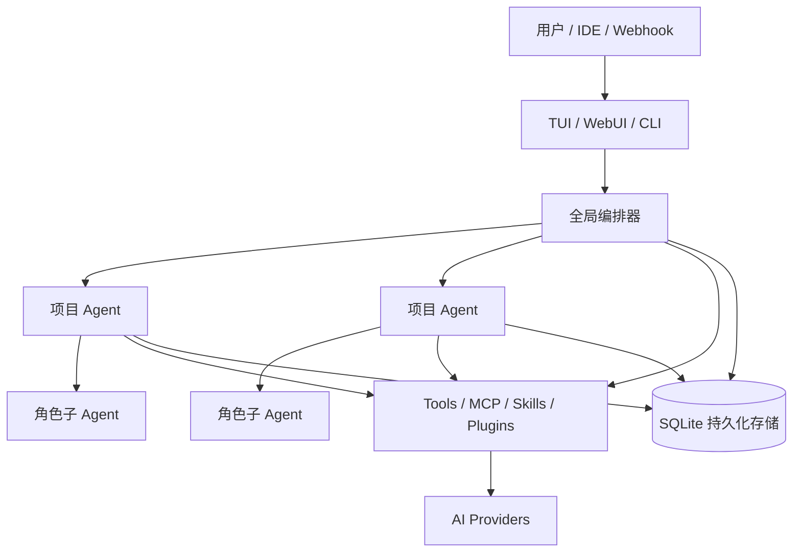

<div align="center">

# CorvusAI

**面向多项目软件工程的本地优先、可持久化 AI Agent 运行时。**

[](https://github.com/RavenholmAlpha/CorvusAI/releases/latest)
[](https://github.com/RavenholmAlpha/CorvusAI/actions/workflows/release.yml)
[](https://nodejs.org/)
[](LICENSE)

[English](README.md) · [文档](docs/) · [版本发布](https://github.com/RavenholmAlpha/CorvusAI/releases) · [问题反馈](https://github.com/RavenholmAlpha/CorvusAI/issues)

</div>

---

CorvusAI 将终端界面、本地鉴权 WebUI、SQLite 持久化状态、专家子 Agent、项目记忆、MCP 互操作以及显式工具权限整合在一个 Node.js 应用中。

它适合需要跨多个代码仓库持续工作的开发者：执行历史、审批状态和项目知识不会因为会话结束或进程重启而丢失。

## 安装

**环境要求：** Node.js 22+ 与 npm。

npm Registry 包暂未发布。当前请直接安装已经验证过的 GitHub Release，无需克隆仓库：

```bash
npm install --global https://github.com/RavenholmAlpha/CorvusAI/releases/download/v0.2.1/ravenholmalpha-corvus-0.2.1.tgz
```

```bash
corvus --version
corvus
```

当前版本：[v0.2.1](https://github.com/RavenholmAlpha/CorvusAI/releases/tag/v0.2.1)。

> 当 `@ravenholmalpha/corvus` 发布到 npm 后，也可以使用 `npm install -g @ravenholmalpha/corvus` 或 `npx @ravenholmalpha/corvus`。

## 首次运行

在 TUI 中执行 `/setting wizard`，依次配置：

1. Provider 协议；
2. API Endpoint；
3. Model；
4. API Key 或 Secret 引用；
5. Main Provider。

用户数据独立于安装目录保存：

| 平台 | 默认位置 |
|---|---|
| Linux / macOS | `~/.corvus` |
| Windows | `%USERPROFILE%\.corvus` |
| 自定义 | 设置 `CORVUS_HOME` |

持久化数据库位于 `~/.corvus/corvus.db`。

## 核心能力

| 能力 | 说明 |
|---|---|
| **持久化执行** | 保存 Run、消息、工具调用、审批、Evidence、事件、快照和可恢复状态。 |
| **多项目编排** | 全局编排器将任务分发给隔离的项目 Agent 和已注册工作区。 |
| **专家角色** | 为子 Agent 复用 Provider、模型、提示词、工具、Skill、并发和预算策略。 |
| **项目记忆** | 跨会话保留架构、决策、约定、踩坑和交接信息。 |
| **MCP 互操作** | 导入、测试、热重载 MCP Server，也可将 Corvus 暴露为 MCP Server。 |
| **人工审批** | 高风险文件、进程、网络和浏览器操作可暂停等待人工确认。 |
| **双控制面** | Ink TUI 与带 Token 鉴权的本地 React WebUI。 |
| **扩展机制** | 内置工具、Skills、Plugins、浏览器自动化、Channels、Automations 和 Nodes。 |

## 架构



治理层级：

1. **全局编排器**：发现工作区并协调跨项目任务；
2. **项目 Agent**：拥有独立的项目会话并在对应工作区执行；
3. **角色子 Agent**：以隔离上下文执行任务，并应用可复用的 Provider 与策略配置。

## 启动方式

```bash
corvus                                    # 交互式 TUI
corvus --web                              # TUI + WebUI
corvus --web-only                         # 仅 WebUI
corvus --web-only --web-port 3085         # 自定义端口
corvus --print "审查当前工作区"             # 单次无头任务
corvus --project my-project               # 已注册的项目 ID 或名称
corvus --resume run_id                    # 恢复持久化任务
```

WebUI 默认绑定 `127.0.0.1:3081`，并使用随机访问 Token。请勿直接暴露到公网。

## Providers 与 Roles

支持三种 Provider 协议：

| 协议 | API 形式 |
|---|---|
| `openai-chat` | `/chat/completions` |
| `openai-responses` | `/responses` |
| `anthropic-messages` | `/messages` |

Provider 负责连接；Role 负责定义专家 Agent 的工作方式。

```json
{
  "providers": {
    "deepseek": {
      "id": "deepseek",
      "protocol": "openai-chat",
      "endpoint": "https://api.deepseek.com/v1",
      "apiKey": "",
      "apiKeyRef": "env:DEEPSEEK_API_KEY",
      "models": ["deepseek-chat"],
      "defaultModel": "deepseek-chat"
    }
  },
  "mainProviderId": "deepseek",
  "agentRoles": {
    "reviewer": {
      "id": "reviewer",
      "label": "代码审查员",
      "providerId": "deepseek",
      "systemPrompt": "审查正确性、安全性、测试覆盖与回归风险。",
      "allowedTools": ["read_file", "grep_search", "git_status"]
    }
  }
}
```

配置后的 Role 会进入 Agent 上下文，可由 `task`、`parallel_tasks` 和 `dispatch_project_task` 主动选择。`manage_role` 支持运行时查询、创建、更新和删除。

详见 [Provider 与 Role](docs/PROVIDERS.md)。

## 持久化任务、项目与记忆

Corvus 会保存完整执行生命周期。常用控制命令：

```text
/runs
/run <run-id>
/approvals
/approve <approval-id>
/resume <run-id>
/evidence last
```

工作区工具包括 `list_workspaces`、`register_workspace`、`unregister_workspace`、`get_workspace_summary`、`dispatch_project_task` 和 `check_subagent_task`。分发时设置 `background: true` 可立即获得持久化任务 ID。

`record_project_memory` 可记录项目或全局的 `architecture`、`decision`、`convention`、`pitfall` 与 `handoff`。`search_global_memory` 可跨会话和项目检索这些知识。

## MCP

Corvus 支持 stdio 与 HTTP MCP Server，并将发现的工具注册为 `mcp_<server>_<tool>`。

```bash
corvus mcp-import --dry-run
corvus mcp-import
```

`manage_mcp` 与 WebUI 支持查询、添加、删除、测试、导入和热重载 MCP Server，无需重启 Corvus。

将 Corvus 接入 MCP 客户端：

```json
{
  "mcpServers": {
    "corvus": {
      "command": "corvus",
      "args": ["mcp-serve"]
    }
  }
}
```

MCP 调用仍然受 Corvus 权限策略约束。

## Skills 与 Plugins

Skill 优先级：

```text
内置 < ~/.corvus/skills < <workspace>/.corvus/skills
```

每个 Skill 是一个包含 `SKILL.md` 的目录：

```markdown
---
name: release-review
description: 审查发布候选版本
triggers: [审查发布, 发布审计]
tools_required: [read_file, grep_search, git_status]
---
# 发布审查
检查兼容性、安全性、测试覆盖和回滚风险。
```

`manage_skill` 与 WebUI 支持全局和工作区 Skill 管理。

Plugin 使用 `corvus.plugin.json` 和 ESM 入口。Native Plugin 属于可信代码，启用前应先审查。详见 [Plugin 开发](docs/plugin-authoring.md)。

## WebUI

使用 `corvus --web` 或 `corvus --web-only` 启动。

WebUI 提供：

- 全局/项目会话与 SSE 流式输出；
- 项目注册、摘要、激活和卸载；
- Agent 层级、持久化任务、审批、Evidence 与审计时间线；
- Memory 与 Skill 管理；
- MCP 配置、测试、导入和重载；
- Provider、Role、权限、Browser、Node、Channel、Automation、Routing、Secret 与 Bundle 设置。

详见 [WebUI 运维说明](docs/WEBUI.md)。

## CLI 参考

```bash
corvus --help
corvus --version
corvus --print "prompt"
corvus --web [--web-port <port>]
corvus --web-only [--web-port <port>]
corvus --project <id-or-name>
corvus --resume <run-id>
corvus --restore-db <backup.db>

corvus setup <minimal|default|full|custom>
corvus bundle plan <minimal|default|full|custom>
corvus bundle apply <minimal|default|full|custom>
corvus permission <safe|balanced|autonomous>
corvus doctor [--json] [--deep]

corvus plugin list
corvus plugin install <directory>
corvus plugin enable <id>
corvus plugin disable <id>
corvus plugin remove <id>

corvus secret list
corvus secret set <name>       # 读取 CORVUS_SECRET_VALUE
corvus secret delete <name>

corvus mcp-import [--dry-run]
corvus mcp-oauth <server-id>
corvus mcp-serve
```

已安装版本的准确语法以 `corvus --help` 为准。

## 配置与安全

配置优先级：

```text
内置默认值 < ~/.corvus/config.json < <workspace>/.corvus/config.json
```

优先使用 Secret 引用，而不是明文：

- `env:VARIABLE_NAME`：环境变量；
- `store:SECRET_NAME`：Corvus 本地加密 Secret Store。

安全机制包括：

- 工具或 Capability 级别的 `allow`、`ask`、`deny`；
- 路径、Shell 与安全 URL 检查；
- WebUI Token 与同源校验；
- Secret 脱敏；
- Webhook 重放和重复消息保护。

Bundle 只控制功能组件，不会静默放宽权限：

| Bundle | 用途 |
|---|---|
| `minimal` | 小型本地核心 |
| `default` | 为兼容性保留的精简工程配置 |
| `full` | **新安装的默认模式**；启用所有内置功能，包括浏览器、调度器、Channels、入站 Webhook、Nodes 与 MCP Server |
| `custom` | 显式组件组合 |

不要提交 `~/.corvus`、数据库或真实凭据。

## 故障排查

### `API key is invalid`

确认协议、Endpoint、Model 和 Key 属于同一个 Provider；检查 `mainProviderId`；如果使用 `env:VARIABLE`，确保启动 Corvus 的进程可以读取该变量。

### `no such column: updated_at`

这表示数据库来自旧 Schema。先备份 `~/.corvus/corvus.db`，安装最新版本并重启 Corvus，让兼容迁移自动执行。使用 `corvus --version` 确认 PATH 中调用的是新版本。

如果不需要保留历史数据，可停止 Corvus、备份 `~/.corvus`、重命名 `corvus.db` 后重新启动。

### 诊断

```bash
corvus doctor --json
npm list --global --depth=0
```

如果原生 SQLite 安装失败，请使用受支持架构上的 Node.js 22+；无法使用预编译二进制时，需要安装平台原生编译工具。

## 开发

```bash
git clone https://github.com/RavenholmAlpha/CorvusAI.git
cd CorvusAI
npm ci
npm run build
npm run dev
```

```bash
npx tsc -p tsconfig.json --noEmit
npx tsc -p webui/tsconfig.json --noEmit
npm run build
npm test
npm audit --audit-level=high
npm pack --dry-run
```

Release 产物包括 npm 兼容 tarball、Release Manifest 和 SBOM。详见 [发布工作流](.github/workflows/release.yml)。

## 文档

- [Agent OS 架构](docs/AGENT_OS.md)
- [Providers 与 Roles](docs/PROVIDERS.md)
- [Model Profiles](docs/MODEL_PROFILES.md)
- [WebUI 运维](docs/WEBUI.md)
- [Plugin 开发](docs/plugin-authoring.md)

## 许可证

[MIT](LICENSE)
